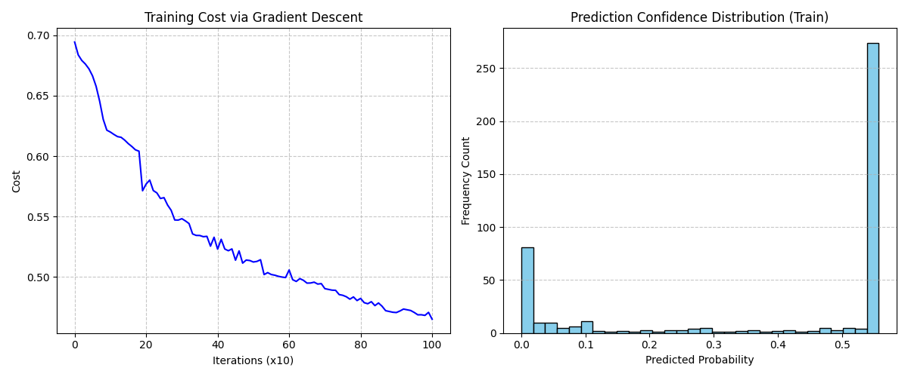

# Breast Cancer Classification: Neural Network from Scratch

**Author:** Rohit  
**Stack:** Python, NumPy, Scikit-learn (dataset loading only), Matplotlib

---

## About the Project

I built this neural network entirely from scratch using only NumPy. No TensorFlow, no PyTorch. The reason I wanted to do this is simple: I wanted to prove to myself that I actually understand what these libraries are doing under the hood, not just which function to call and also wanted to practically apply what i learned form deep learning specialization by andrew ng.

I picked the Wisconsin Breast Cancer Dataset because it is a real, meaningful classification problem. Predicting whether a tumor is malignant or benign has real consequences, so it forced me to think carefully about which metrics actually matter — not just accuracy.

---

## How It Works

The architecture is a 2-layer fully connected neural network. All the matrix math is written by hand.

### Architecture

| Layer | Type | Nodes | Activation |
| :--- | :--- | :--- | :--- |
| Input | Features | 30 | None |
| Hidden Layer 1 | Dense | 4 | ReLU |
| Output | Dense | 1 | Sigmoid |

**Input:** 30 continuous features per tumor sample (radius, texture, perimeter, etc.)  
**Output:** A probability between 0 and 1. Values >= 0.5 are classified as Malignant.

### Forward Propagation

The input matrix `X` of shape `(30, m)` is multiplied by the weight matrix `W1` of shape `(4, 30)`. A bias `b1` is added and then passed through ReLU, which zeros out any negative activations. The hidden layer output then goes through the output layer — same idea but with Sigmoid instead, which squashes the result to a 0-1 probability.

### Why ReLU in the Hidden Layer and Sigmoid at the Output?

ReLU is fast and avoids the vanishing gradient problem in the hidden layer. Sigmoid specifically at the output is necessary because this is a binary classification. We need a number between 0 and 1 that we can interpret as a probability.

### Cost Function: Cross-Entropy Loss

I chose Cross-Entropy (also called Log Loss) because it is the right loss function for binary classification. Unlike MSE, it heavily penalizes high-confidence wrong predictions. If the model says 99% probability of benign but the tumor is actually malignant, the penalty is enormous. That is exactly the behavior we want for medical data.

### Backpropagation

Using the chain rule, I manually compute the gradients `dW1`, `db1`, `dW2`, `db2` by working backwards from the output error. The parameters are then updated using plain Batch Gradient Descent.

**Hyperparameters:**
- Hidden nodes: 4
- Learning rate: 0.001
- Iterations: 1000

---

## Results

The model was trained on 80% of the 569-sample dataset and evaluated on the remaining 20%.

| Metric | Score |
| :--- | :--- |
| Training Accuracy | 91.21% |
| Test Accuracy | 93.86% |

### Why I focused on Recall, not just Accuracy

In a cancer detection problem, a false negative — telling someone their tumor is benign when it is actually malignant — is far worse than a false positive. So I evaluated Recall (Sensitivity) for the Malignant class specifically.

### Confusion Matrix (Test Set)

```
Predicted:  Malignant   Benign
Actual Malignant:  38        5
Actual Benign:      2       69
```

- **Malignant Recall: 88.37%** — The model correctly identified 38 out of 43 actual malignant cases.
- **Malignant Precision: 95.00%** — When it predicted malignant, it was right 95% of the time.



The left chart shows cost dropping steadily over 1000 gradient descent iterations. The right chart is the confidence distribution — ideally the model should be pushing predictions to either extreme (0 or 1), not sitting in the middle around 0.5.

---

## Project Structure

```
breast-cancer-nn/
├── data.py         # Loads the dataset and splits into train/test
├── model.py        # Forward pass, backward pass, parameter update logic
├── train.py        # Training loop (gradient descent over 1000 iterations)
├── utils.py        # Sigmoid, ReLU, Cross-Entropy cost, and accuracy helper functions
└── main.py         # Runs everything, prints metrics, generates and saves plots
```

---

## How to Run It

```bash
pip install numpy scikit-learn matplotlib
python main.py
```

---

## Note from the student

Deriving and implementing backpropagation from the chain rule by hand — especially keeping the matrix dimensions straight — was the hardest and most satisfying part of this project. Once the cost started dropping smoothly, I genuinely felt like I understood neural networks in a way that just using Keras never gave me.
